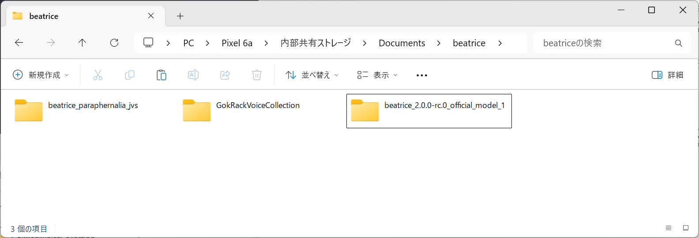
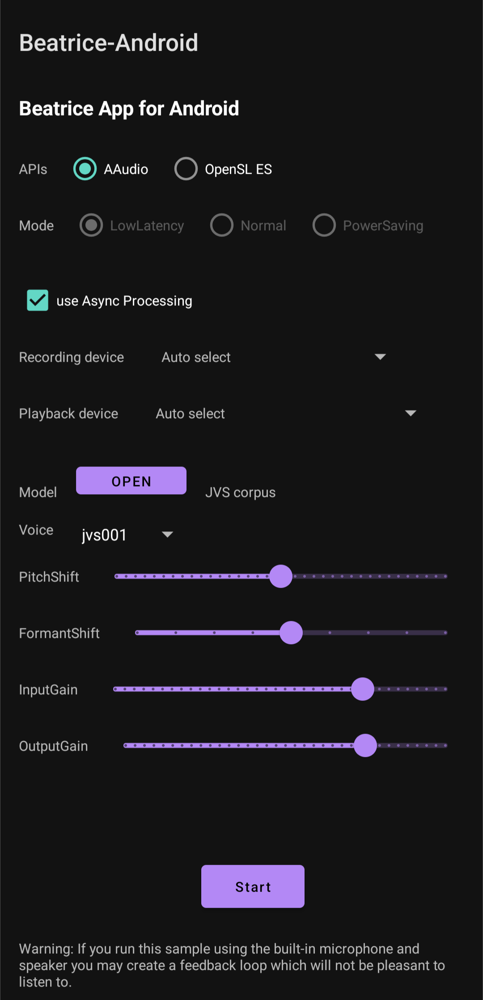

# 使い方

## 動作検証環境

v0.0.3 時点では、SoC に ARM v8.2 以降を搭載している端末向けのみのビルドを行っておりますので、使う際もその条件を満たす端末でお使いください。

開発者が具体的に使用している端末は、下記の２つです。

- Google Pixel 6a
- Lenovo Y700 2022

## インストール方法

いわゆる[野良アプリのインストール](https://smartasw.com/archives/4011)に相当しますので、適宜設定をしたうえで、このレポジトリの [Releases](https://github.com/Mark-GokRack/beatrice-android/releases) から apk ファイルをダウンロードしてインストールしてください。

もしくは、開発者モードを有効にして PC などに接続したうえで PC に apk ファイルをダウンロードし、

> adb install app-release.apk

などのコマンドでインストールしてください。

## 事前準備

動作前に、beatrice v2 のモデルをスマホ内の適当なフォルダに配置してください。

開発者の場合、上図のように 内部ストレージの Documents フォルダ内に beatrice フォルダを作り、その中に公式のモデルと自作のモデルを配置しております。

また、できれば有線接続のマイクかスピーカーを接続しておくことを推奨します。
Bluetooth 接続のものでも動作はしますが、レイテンシ(音声変換の遅れ)が結構大きくなることにご注意ください。

## 操作方法

アプリを開くと上図のような画面が出てくるかと思います。

各項目の意味合いは下記のとおりです。

- APIs
  - Android の Audio API の選択です。特に理由がなければ AAudio で良いはずです。
- Mode
  - AAudio の場合に選択可能な、レイテンシに関連するモードです。特に理由がなければ LowLatency のままで良いはずです。
- use Async Processing
  - beatrice の処理を AAudio のコールバックとは別のスレッドで実行するオプションです。
  - AAudio / Low Latency との組み合わせのみが有効になっています。
  - こちらも特に理由がなければチェックを入れておけば大丈夫です。

- Recording device
  - ここではマイクなどの音声入力デバイスの選択を行います。
  - Auto select で何が選ばれるかは端末依存かも…？
  - Bluetooth 接続のものも選択可能ですが、レイテンシが結構増えてしまうので有線接続を推奨します。

- Playback device
  - ここではスピーカーなどの音声出力デバイスの選択を行います。
  - マイクと近い位置にあるスピーカーが選択されていると、ハウリングを起こす恐れがあるのでご注意ください。
  - Bluetooth 接続のものも選択可能ですが、レイテンシが結構増えてしまうので有線接続を推奨します。

- Model 
  - Open ボタンをタップすると beatrice のモデル選択画面が表示されます。
  - また、右側には現在選択されている Beatrice のモデル名を表示しています。

- Voice
  - モデルに含まれている話者を選択できます。
  - VST版と異なり、Voice Morphing Mode はまだ未実装です。
    - 信号処理の問題というよりは UI の用意が間に合っていないので……。

- Pitch Shift
  - 音の高さを調整するスライダーです。単位は半音で、 +12 が １オクターブ上、 -12 が １オクターブ下に相当します。
- Formant Shift
  - 音のフォルマントを調整するスライダーです。 大雑把なイメージとしては、+方向にずらすと女性らしい声に、-方向にずらすと男性らしい声になります。
- Input Gain
  - マイクのゲイン調整です。
- Output Gain
  - スピーカーのゲイン調整です。

- Start
  - このボタンを押すと beatrice の音声変換処理が開始されます。
  - 音声変換処理を有効にしたまま他のアプリに遷移すると、このアプリの処理優先度が下げられてしまい音がプツプツ切れる現象が見られたため、他のアプリに遷移したら自動的に音声変換処理を停止するようにしています。