# 使い方

## 動作検証環境

このアプリは SoC に ARM v8.2 以降を搭載している端末向けのみのビルドを行っておりますので、使う際もその条件を満たす端末でお使いください。

開発者が実際に使用している端末は、下記の２つです。

- Google Pixel 6a
- Lenovo Y700 2022

## インストール方法

いわゆる[野良アプリのインストール](https://smartasw.com/archives/4011)に相当しますので、適宜設定をしたうえで、このレポジトリの [Releases](https://github.com/Mark-GokRack/beatrice-android/releases) から apk ファイルをダウンロードしてインストールしてください。

もしくは、スマホの開発者モードを有効にして PC などに接続したうえで PC に apk ファイルをダウンロードし、

> adb install app-release.apk

などのコマンドでインストールしてください。

## 事前準備

動作前に、beatrice v2 のモデルをスマホ内の適当なフォルダに配置してください。

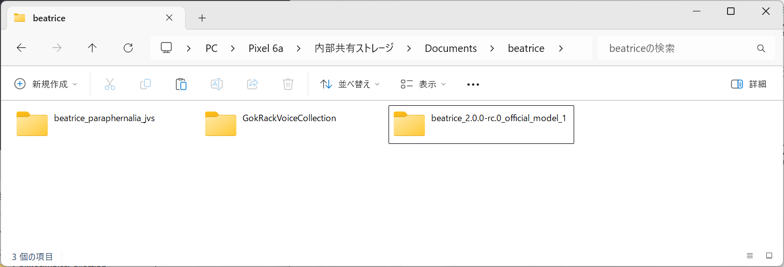

開発者の場合、上図のように 内部ストレージの Documents フォルダ内に beatrice フォルダを作り、その中に公式のモデルと自作のモデルを配置しております。

またハウリングを防ぐため、できれば有線接続のマイクかスピーカー、ヘッドセットなどを接続しておくことを推奨します。  
Bluetooth 接続のものでも動作はしますが、レイテンシ(音声変換の遅れ)が結構大きくなることにご注意ください。  
（音量を上げすぎなければスマホ本体のマイクとスピーカーでもハウリングを起こさずに動作しそうではありますが。）

## 画面構成

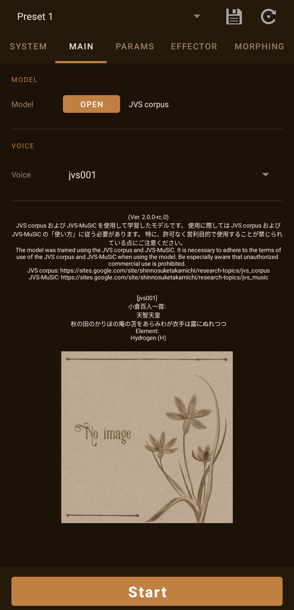

アプリを開くと、画面上部にタブが並んだビューが表示されます。タブを左右にスワイプするか、タブをタップすることで各設定画面に切り替えられます。  
画面下部には状態表示テキストと **Start / Stop** ボタンが常時表示されており、どのタブを開いていても音声変換の開始・停止が行えます。

タブは左から順に **System → Main → Params → Effector → Advanced → Morphing → Settings** の 7 つです。

---

### System タブ

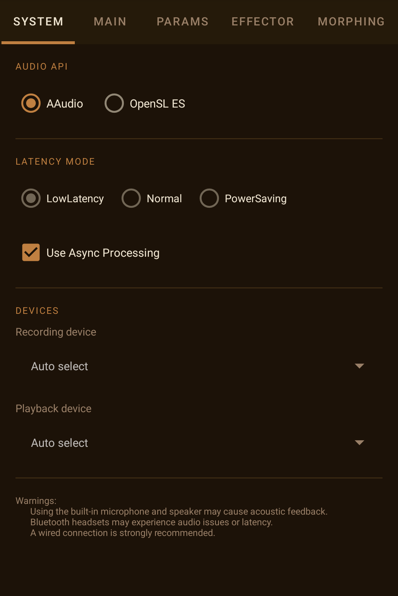

音声 API やデバイス選択など、システム寄りの設定を行います。
音声処理中はこのタブの内容について設定を変更できません。

- **Audio API**
  - 使用する Android の音声 API を選択します。特に理由がなければ **AAudio** で構いません。
- **Latency Mode**
  - AAudio 選択時に有効になる、レイテンシに関するモードです。特に理由がなければ **LowLatency** のままで良いはずです。
- **Use Async Processing**
  - beatrice の処理を AAudio のコールバックとは別スレッドで実行するオプションです。
  - AAudio / LowLatency との組み合わせのみ有効です。
- **Use AEC**
  - デバイス内蔵の AEC を有効にするフラグを立てます。
  - ハウリング防止に効果がある可能性がある反面、音量や音声品質、レイテンシを悪化させます。
- **Recording device**
  - マイクなどの音声入力デバイスを選択します。
  - Bluetooth 接続のものも選択できますが、レイテンシが増えるため有線接続を推奨します。
- **Playback device**
  - スピーカーなどの音声出力デバイスを選択します。
  - Bluetooth 接続のものも選択できますが、レイテンシが増えるため有線接続を推奨します。
  - マイクに近いスピーカーを選択するとハウリングを起こす恐れがありますのでご注意ください。

---

### Main タブ

使用するモデルと話者を選択します。

- **Model**
  - **Open** ボタンをタップするとモデルファイルの選択画面が開きます。
  - 選択後、現在読み込まれているモデル名が右側に表示されます。
  - 音声処理中はモデルの切り替えはできません。
- **Voice**
  - モデルに含まれている話者をスピナーから選択できます。
  - 表示される利用規約を守っての使用をお願いします。
  - 話者が２つ以上含まれているモデルの場合、末尾に "Voice Morphing Mode" が追加されます。
  - このモードを選択した場合、後述する Morphing タブの内容に従って話者特徴量を混合した声質になります。

---

### Params タブ

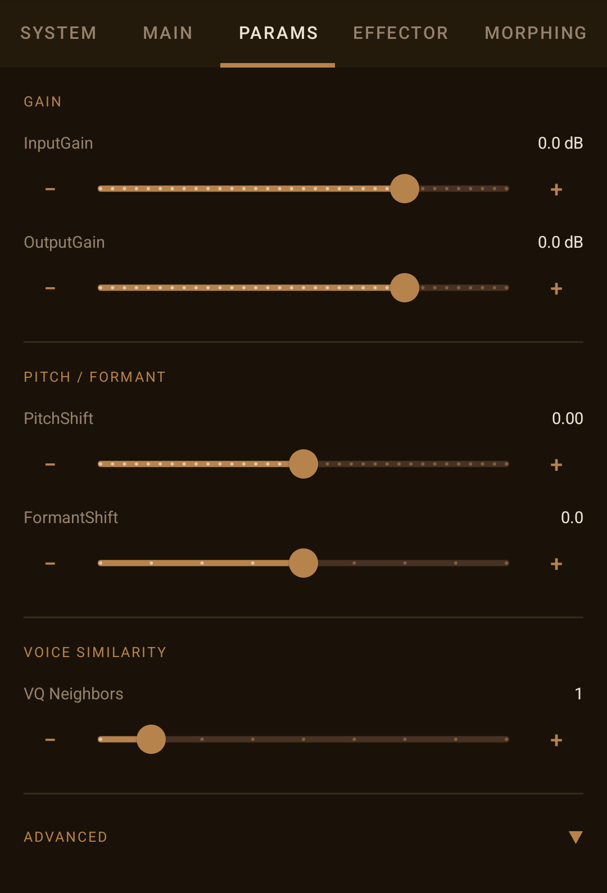

Beatrice の動作をコントロールするための音声変換パラメータを調整します。  
各スライダーの左右にある **−** / **+** ボタンで微調整ができます。  
画面が煩雑になるのを避けるため、高度なパラメータについては初期状態では ADVANCED の項目の中に隠れています。

- **InputGain** / **OutputGain**
  - マイク入力とスピーカー出力のゲイン調整です（単位: dB）。
  - 上げすぎると音が潰れたりハウリングの原因となりますため、ご注意ください。
- **PitchShift**
  - 音声の高さを調整します（単位: 半音）。
  - +12 で 1 オクターブ上、-12 で 1 オクターブ下に相当します。
- **FormantShift**
  - 音声のフォルマントを調整します。
  - + 方向で女性らしい声に、− 方向で男性らしい声になる傾向があります。
- **VQ Neighbors**
  - 声質の変換品質に関わるパラメータです。
  - 値を大きくすると話者類似度が向上しますが、発音が不明瞭になる傾向があります。

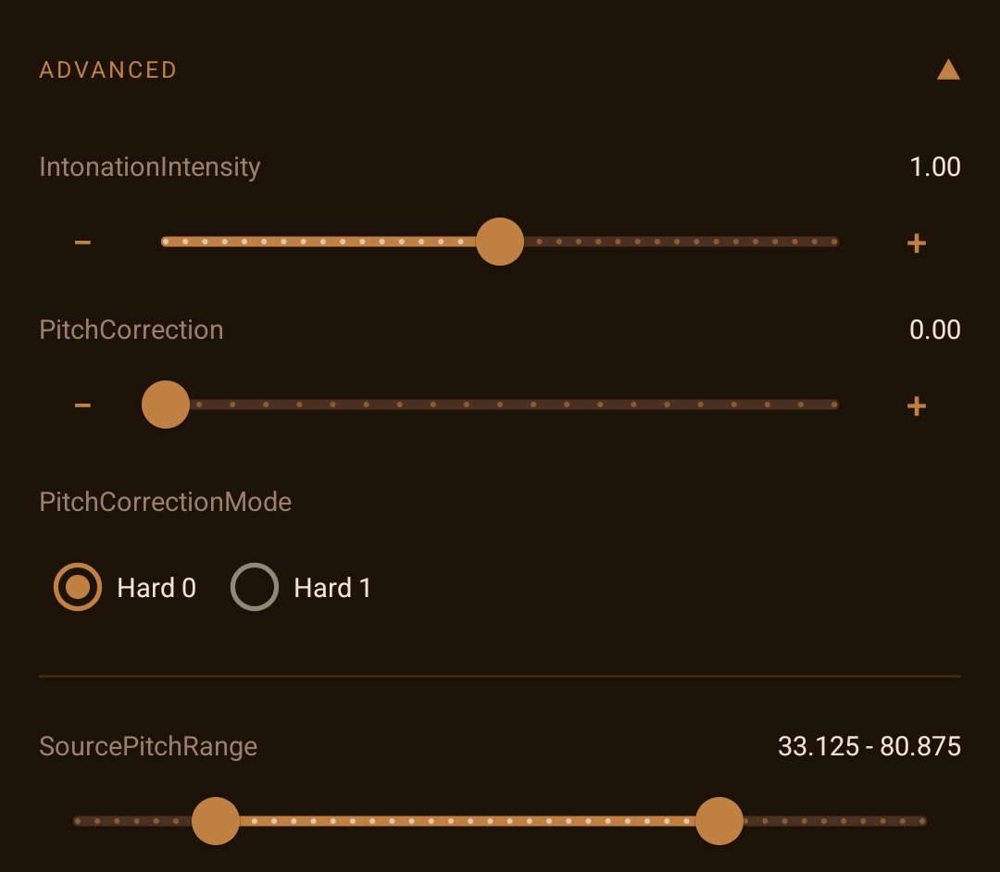

- **Advanced**
  - 音声変換処理に関する高度なパラメータを調整します。

    - **IntonationIntensity**
        - 変換後の声のイントネーション（抑揚）の強度を調整します。大きくなるにつれて抑揚が大げさになります。
    - **PitchCorrection**
        - ピッチ補正の強度を調整します（0.0 ～ 1.0）。 0 で無効になります。
        - 強度が高い場合、出力音声の音高が十二平均律に近づいていきます。
    - **PitchCorrectionMode**
        - ピッチ補正のアルゴリズムを **Hard 0** / **Hard 1** から選択します。
    - **SourcePitchRange**
        - 入力音声として想定する音声。レンジスライダーで下限・上限を個別に調整できます。
        - 単位は MIDI ノード番号で、周波数に変換した値も隣に表示しています。

---

---

### Effector タブ

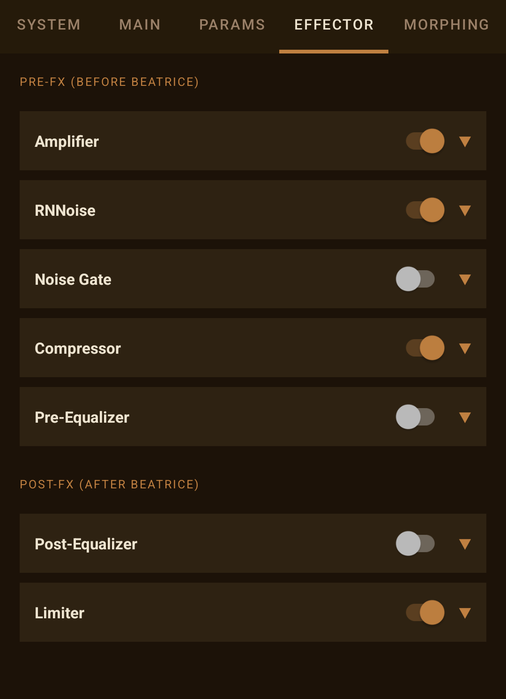

Beatrice の処理を行う前後に配置された エフェクト（音響効果）を制御するタブです。  
各項目の右側には有効・無効を切り替えるトグルボタンが配置されています。  

- **Pre-FX (before Beatrice)**
  - 音声変換の前に適用されるエフェクタ類。

  - **Amplifier**  
    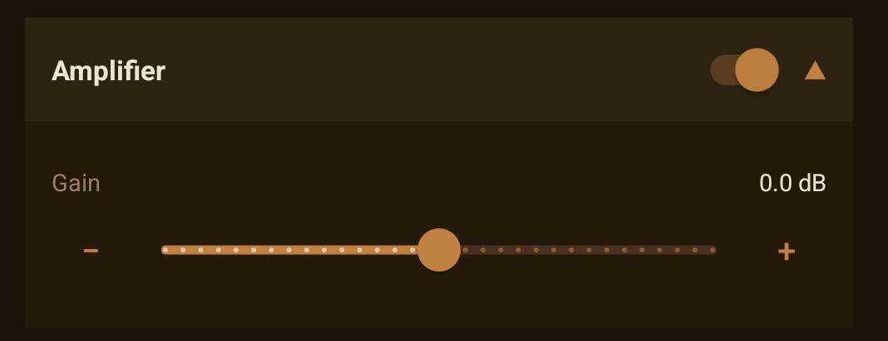
    - マイク入力に対するゲインを -30 ~ +30 dB の範囲で調整します。
  - **Noise Gate**  
    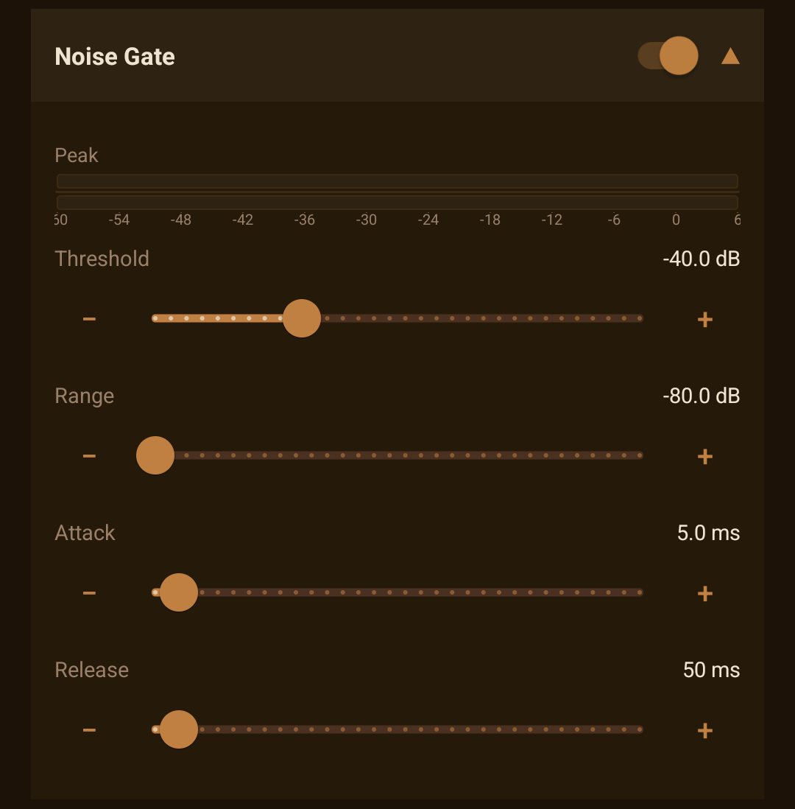
    - 閾値(Threshold)を下回る音量の音声が入力されたときに出力を絞るエフェクタ。
    - 各項目の内容は下記の通り
      - Threshold : 音声がゲートを開く基準となる音量
      - Range : ゲートが閉じたときの減衰量
      - Attack : ゲートが開く際にかかる時間
      - Release : ゲートが閉じる際にかかる時間
  - **Compressor**  
    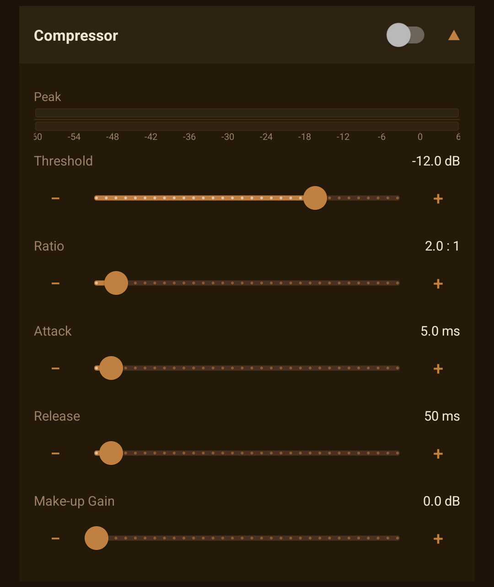
    - 閾値(Threshold)を下回る音量の音声が入力されたときに出力音声の音量を圧縮するエフェクタ。
    - 各項目の内容は下記の通り
      - Threshold : コンプレッションを開始する音量レベル
      - Ratio : 音量を圧縮する比率
      - Attack : コンプレッションを開始するまでの時間
      - Release : コンプレッションを終了するまでの時間
      - Makeup Gain : コンプレッション後の音量調整
  - **Pre-Equalizer**  
    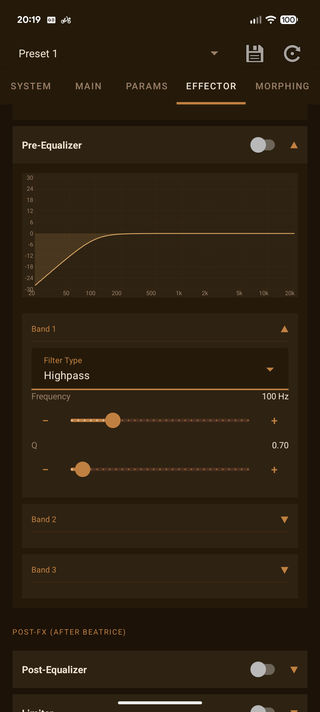
    - 3バンドの Biquad フィルタを用いてイコライジングを行うエフェクタ。
      - Beatrice の処理前の EQ の役割は Beatrice に渡すノイズ低減と考えて、バンド数は少なめに設定。
    - 各バンドの設定項目は下記の通り
      - Filter Type
        - Peaking, Lowpass, Highpass, LowShelf, HighShelf, Notch, Allpass の７種類から選択可能
      - Frequency
        - フィルタの中心周波数を調整するスライダー
      - Q
        - フィルタ特性の鋭さを調整するスライダー
      - Gain (Peaking, LowShelf, HighShelf のみ)
        - フィルタによって上げ下げするゲインを調整するスライダー
- **Post-FX (after Beatrice)**
  - 音声変換の後に適用されるエフェクトです。
  - **Post-Equalizer**  
    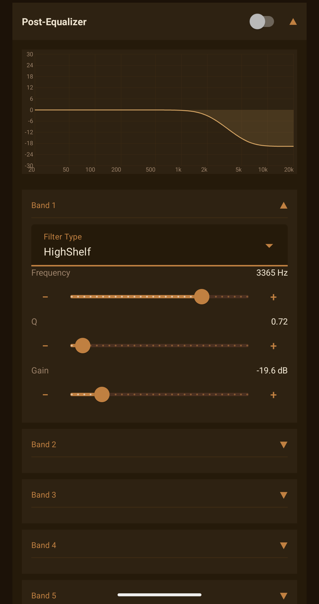
    - 設定項目の内容については Pre Equalizer のものと同じ。
      - 役割としては出力の音色調整となるため、 pre-EQ に比べてバンド数を多めに確保（5バンド）。
  - **Limiter**  
    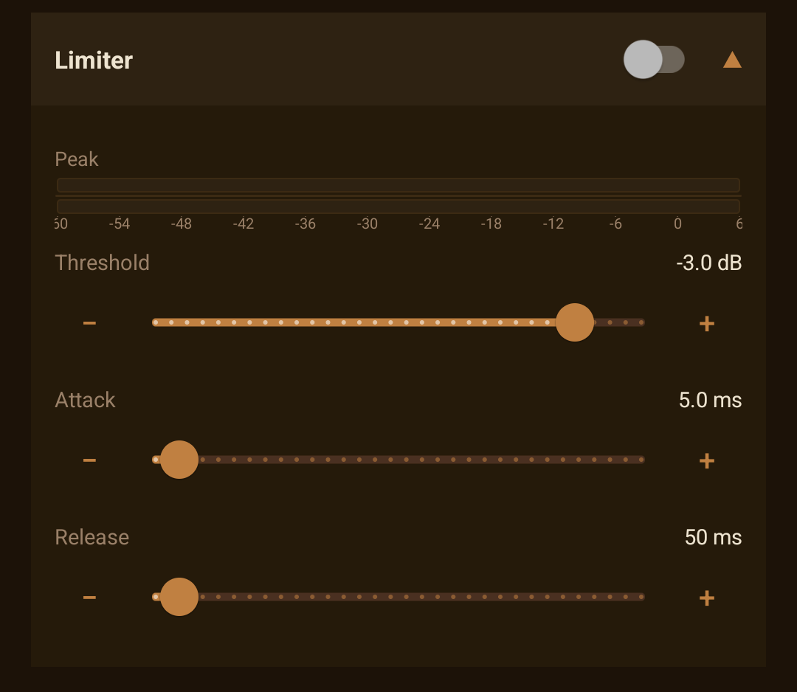
    - 閾値(Threshold)を下回る音量の音声が入力されたときに出力音声の音量を閾値以下になるように強制的に下げるエフェクタ。
    - 各項目の内容は下記の通り
      - Threshold : 音量を制限する最大値
      - Attack : 制限が適用されるまでの時間
      - Release : 制限が解除されるまでの時間

---

### Morphing タブ

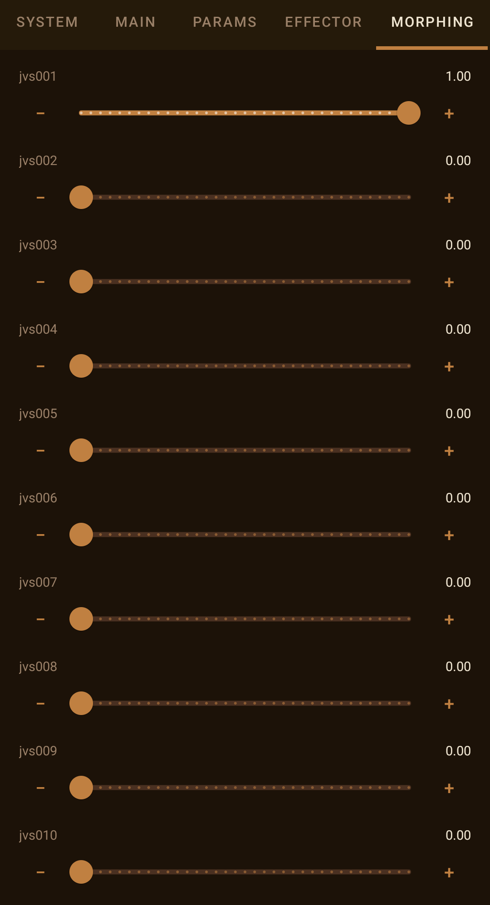

**Voice Morphing Mode** を選択した際にモデルに含まれる複数の話者を混ぜ合わせる重みを調整します。  
各話者に対応したスライダーが一覧表示されるので、合成したい割合に合わせて調整してください。
なお、処理不可を抑えるため、 rc.0 版以降のモデルについては混ぜ合わせることの出来る話者数に上限を設定しています(現在は **8** に設定中)。

---

### Preset view

各種パラメータの設定値を８個まで保存して切り替えることが出来ます。
💾アイコンをタップするまでは設定値は保存されませんので、ご注意ください。

- **Save(💾)**
  - 現在の設定を保存します。
- **Reset to Default (🔃)**
  - すべての設定をデフォルト値にリセットします。

## 操作手順

1. **System タブ**でデバイスや API を設定する。
2. **Main タブ**でモデルを読み込み、話者を選ぶ。
3. **Main タブ**下部の **Start** ボタンをタップして音声変換を開始する。
4. **Params タブ**、**Effector タブ**、**Morphing タブ**で各種パラメータを好みに合わせて調整する。
5. 停止するには **Main タブ** 下部の **Stop** ボタンをタップする（他のアプリに切り替えると自動的に停止します）。

