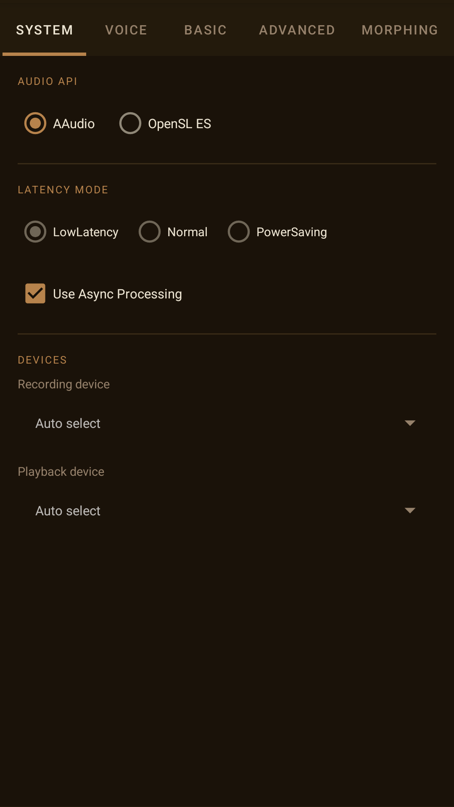
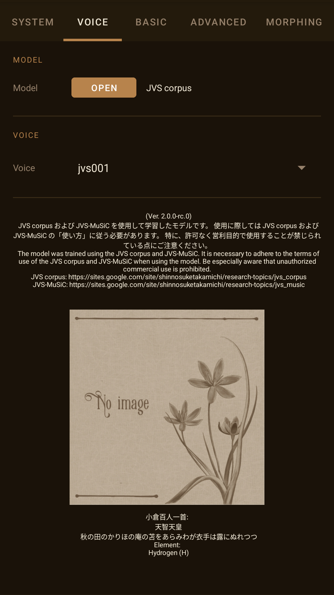
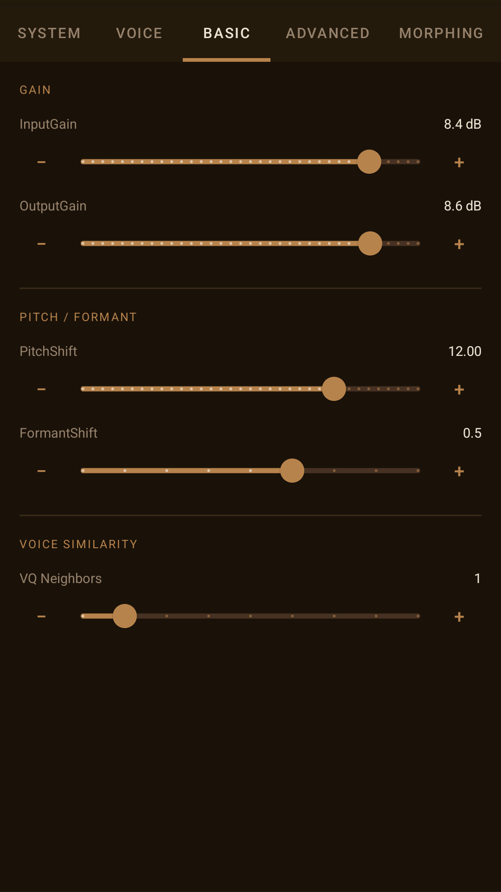
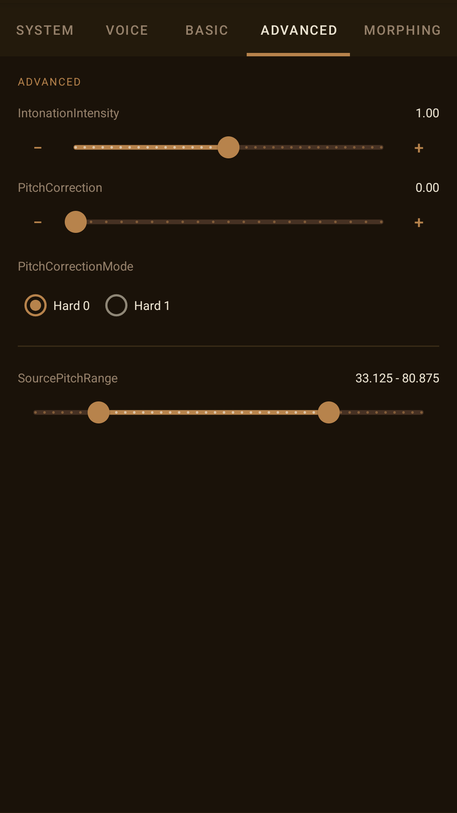
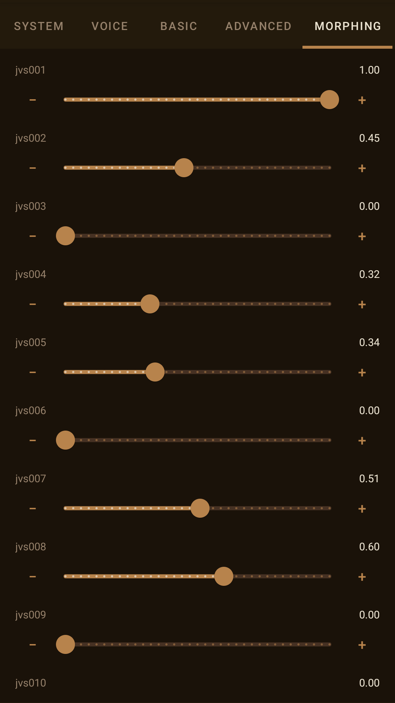
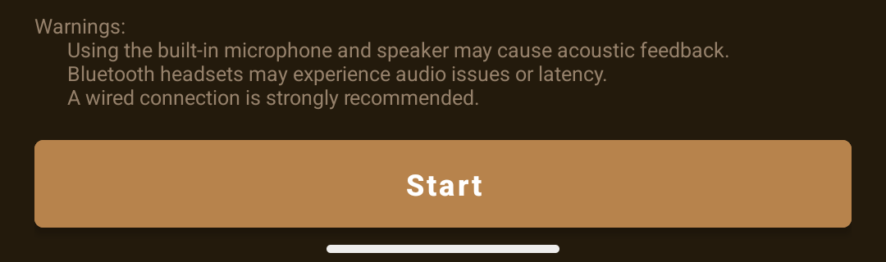

# 使い方

## 動作検証環境

このアプリは SoC に ARM v8.2 以降を搭載している端末向けのみのビルドを行っておりますので、使う際もその条件を満たす端末でお使いください。

開発者が実際に使用している端末は、下記の２つです。

- Google Pixel 6a
- Lenovo Y700 2022

## インストール方法

いわゆる[野良アプリのインストール](https://smartasw.com/archives/4011)に相当しますので、適宜設定をしたうえで、このレポジトリの [Releases](https://github.com/Mark-GokRack/beatrice-android/releases) から apk ファイルをダウンロードしてインストールしてください。

もしくは、スマホの開発者モードを有効にして PC などに接続したうえで PC に apk ファイルをダウンロードし、

> adb install app-release.apk

などのコマンドでインストールしてください。

## 事前準備

動作前に、beatrice v2 のモデルをスマホ内の適当なフォルダに配置してください。

開発者の場合、上図のように 内部ストレージの Documents フォルダ内に beatrice フォルダを作り、その中に公式のモデルと自作のモデルを配置しております。

またハウリングを防ぐため、できれば有線接続のマイクかスピーカー、ヘッドセットなどを接続しておくことを推奨します。  
Bluetooth 接続のものでも動作はしますが、レイテンシ(音声変換の遅れ)が結構大きくなることにご注意ください。  
（音量を上げすぎなければスマホ本体のマイクとスピーカーでもハウリングを起こさずに動作しそうではありますが。）

## 画面構成

アプリを開くと、画面上部にタブが並んだビューが表示されます。タブを左右にスワイプするか、タブをタップすることで各設定画面に切り替えられます。  
画面下部には状態表示テキストと **Start / Stop** ボタンが常時表示されており、どのタブを開いていても音声変換の開始・停止が行えます。

タブは左から順に **System → Voice → Basic → Advanced → Morphing** の 5 つです。

---

    

### System タブ

音声 API やデバイス選択など、システム寄りの設定を行います。

- **Audio API**
  - 使用する Android の音声 API を選択します。特に理由がなければ **AAudio** で構いません。
- **Latency Mode**
  - AAudio 選択時に有効になる、レイテンシに関するモードです。特に理由がなければ **LowLatency** のままで良いはずです。
- **Use Async Processing**
  - beatrice の処理を AAudio のコールバックとは別スレッドで実行するオプションです。AAudio / LowLatency との組み合わせのみ有効です。特に理由がなければチェックを入れておいて問題ありません。
- **Recording device**
  - マイクなどの音声入力デバイスを選択します。Bluetooth 接続のものも選択できますが、レイテンシが増えるため有線接続を推奨します。
- **Playback device**
  - スピーカーなどの音声出力デバイスを選択します。マイクに近いスピーカーを選択するとハウリングを起こす恐れがありますのでご注意ください。Bluetooth 接続のものも選択できますが、レイテンシが増えるため有線接続を推奨します。

---

### Voice タブ

使用するモデルと話者を選択します。

- **Model**
  - **Open** ボタンをタップするとモデルファイルの選択画面が開きます。選択後、現在読み込まれているモデル名が右側に表示されます。
- **Voice**
  - モデルに含まれている話者をスピナーから選択できます。選択した話者の説明文やポートレート画像が下部に表示されます（モデルに情報が含まれている場合）。
  - 話者が２つ以上含まれているモデルの場合、末尾に "Voice Morphing Mode" が追加されます。このモードを選択した場合、後述する Morphing タブの内容に従って話者特徴量を混合した声質になります。

---

### Basic タブ

日常的によく使う音声変換パラメータを調整します。各スライダーの左右にある **−** / **+** ボタンで微調整ができます。

- **InputGain**
  - マイク入力のゲイン調整です（単位: dB）。上げすぎると音が潰れるのでご注意ください。
- **OutputGain**
  - スピーカー出力のゲイン調整です（単位: dB）。上げすぎるとハウリングの原因になります。
- **PitchShift**
  - 音声の高さを調整します（単位: 半音）。+12 で 1 オクターブ上、-12 で 1 オクターブ下に相当します。
- **FormantShift**
  - 音声のフォルマントを調整します。+ 方向で女性らしい声に、− 方向で男性らしい声になる傾向があります。
- **VQ Neighbors**
  - 声質の変換品質に関わるパラメータです。値を大きくすると話者類似度が向上しますが、発音が不明瞭になる傾向があります。

---

### Advanced タブ

ピッチ処理に関する高度なパラメータを調整します。

- **IntonationIntensity**
  - 変換後の声のイントネーション（抑揚）の強度を調整します。
- **PitchCorrection**
  - ピッチ補正の強度を調整します（0.0 ～ 1.0）。
- **PitchCorrectionMode**
  - ピッチ補正のアルゴリズムを **Hard 0** / **Hard 1** から選択します。
- **SourcePitchRange**
  - 入力音声として想定するピッチ（基本周波数）の範囲を設定する…のでしょうか？ (あまり把握してません)。レンジスライダーで下限・上限を個別に調整できます。

---

### Morphing タブ

**Voice Morphing Mode** を選択した際にモデルに含まれる複数の話者を混ぜ合わせる重みを調整します。  
各話者に対応したスライダーが一覧表示されるので、合成したい割合に合わせて調整してください。
なお、処理不可を抑えるため、 rc.0 版以降のモデルについては混ぜ合わせることの出来る話者数に上限を設定しています(現在は **8** に設定中)。

---

## 操作手順

1. **System タブ**でデバイスや API を設定する。
2. **Voice タブ**でモデルを読み込み、話者を選ぶ。
3. **Basic タブ**で PitchShift・FormantShift などを好みに合わせて調整する。
4. 画面下部の **Start** ボタンをタップして音声変換を開始する。

5. 停止するには **Stop** ボタンをタップする（他のアプリに切り替えると自動的に停止します）。

